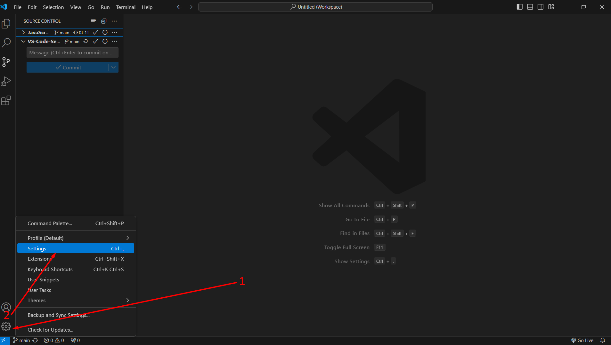
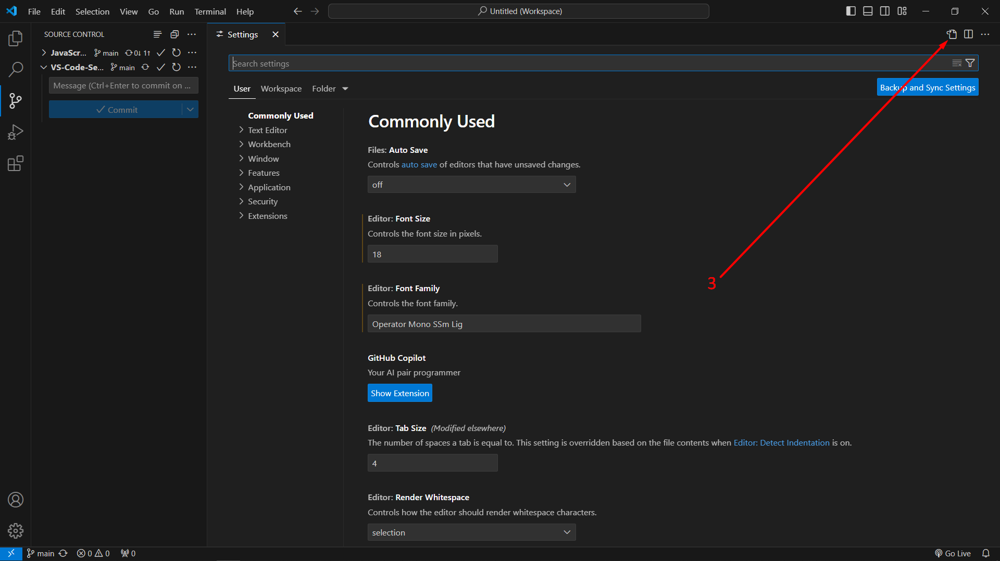
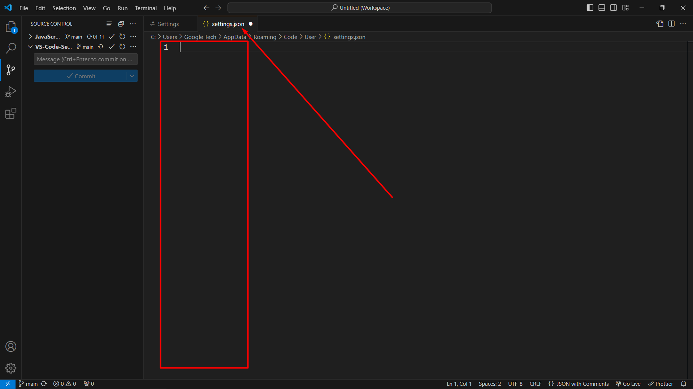
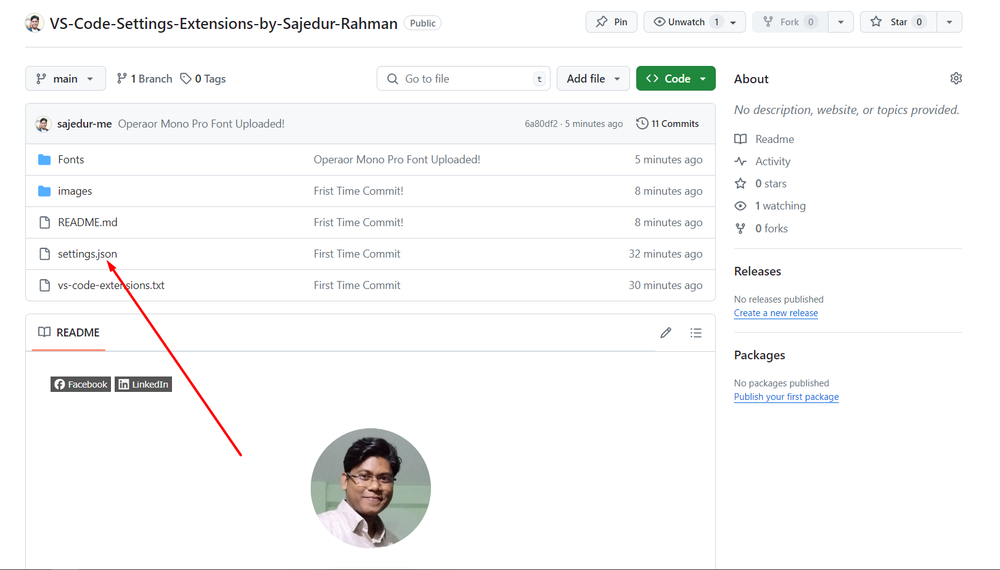
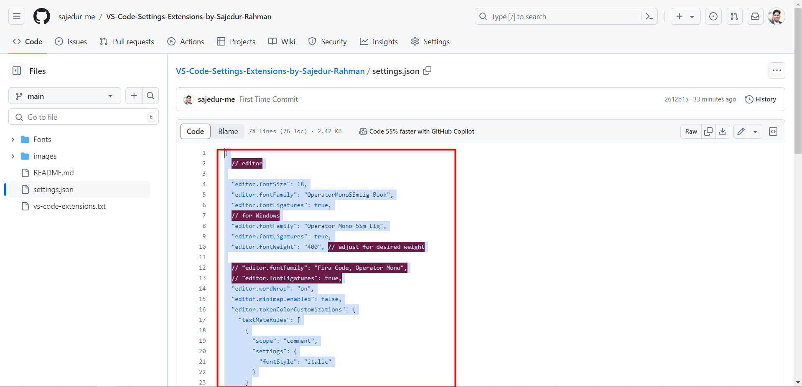
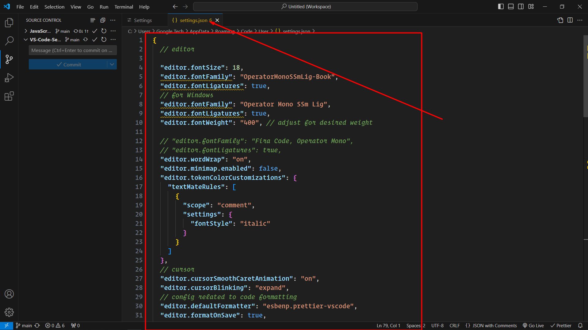
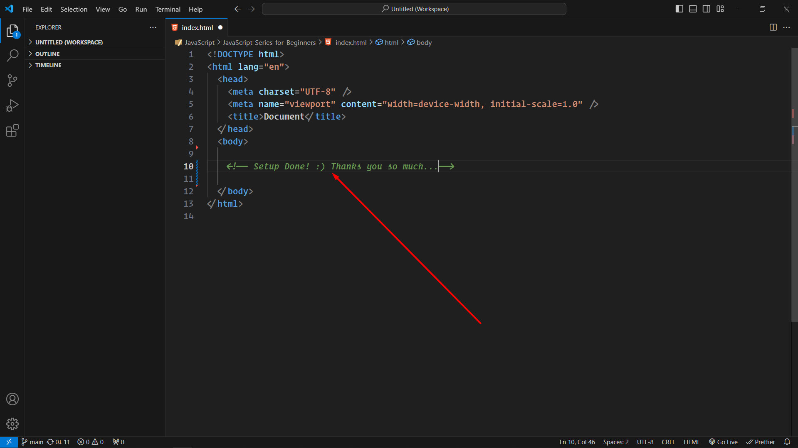

[![Facebook][facebook-shield]][facebook-url]
[![LinkedIn][linkedin-shield]][linkedin-url]

<!-- PROJECT LOGO -->
 

    
  </a>

  <h3 align="center">My Visual Studio Code Settings & Extensions</h3>

<!-- Insructions -->

## Instructions

First download the font, then go to your PC font settings and install the font by drag and drop.

You can copy the json from settings.json file and paste it into your VS Code settings.json file. Also you will find all the plugins that I use.

--> Step #1 Go to VS code Settings

  

    
  </a>

--> Step #2 Go to VS code Settings

  

    
  </a>

--> Step #3 Go to VS code Settings

  

    
  </a>

--> Step #4 Go to VS code Settings

  

    
  </a>

--> Step #5 Go to VS code Settings

  

    
  </a>

--> Step #6 Go to VS code Settings

  

    
  </a>

--> Step #7 Go to VS code Settings

  

    
  </a>

<!-- CONTACT -->

## Contact

Md. Sajedur Rahman - [sajedur.me@gmail.com](mailto:sajedur.me@gmail.com)

Website - [www.leocoder.com](https://leocoder.com/)

<!-- MARKDOWN LINKS & IMAGES -->

[facebook-shield]: https://img.shields.io/badge/-Facebook-black.svg?style=flat-square&logo=facebook&color=555&logoColor=white
[facebook-url]: https://www.facebook.com/profile.php?id=100090977744360
[linkedin-shield]: https://img.shields.io/badge/-LinkedIn-black.svg?style=flat-square&logo=linkedin&colorB=555
[linkedin-url]: https://www.linkedin.com/in/sajedur-me/
